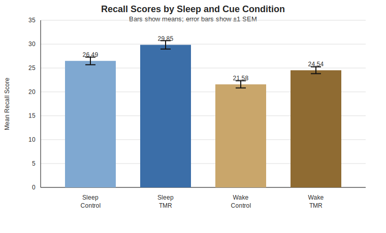

# Sleep and Memory: Short Data Report

## 1) What was tested
- This dataset uses a **2×2 design** (two factors, each with two groups):
  - **Sleep condition**: Sleep vs. Wake
  - **Cue condition**: TMR vs. Control
- Outcome: **recall score** (higher = better memory recall).
- Sample size: 80 participants (20 in each group).

## 2) Main results in plain language
- **Sleep effect:** strong and statistically significant, *F*(1, 76) = 42.01, *p* < .001, partial η² = 0.356.
  - Simple meaning: people who slept recalled more than people who stayed awake.
- **Cue (TMR) effect:** significant, *F*(1, 76) = 16.01, *p* < .001, partial η² = 0.174.
  - Simple meaning: TMR (targeted memory reactivation, a reminder cue linked to learned material) improved recall.
- **Interaction (Sleep × Cue):** not significant, *F*(1, 76) = 0.07, *p* = 0.798, partial η² = 0.001.
  - Simple meaning: the TMR benefit looked similar in both Sleep and Wake groups.

## 3) Group averages
| Sleep | Cue | n | Mean recall | SD |
|---|---|---:|---:|---:|
| Sleep | Control | 20 | 26.49 | 3.58 |
| Sleep | TMR | 20 | 29.85 | 3.92 |
| Wake | Control | 20 | 21.58 | 3.36 |
| Wake | TMR | 20 | 24.54 | 3.22 |

## 4) Graph

### Graph explanation (easy language)
- Each bar is the average recall score for one group.
- Error bars show **SEM** (standard error of the mean), which gives a sense of estimate precision.
- The pattern is clear: Sleep groups are higher than Wake groups, and TMR groups are higher than Control groups.
- The parallel pattern across Sleep and Wake supports the non-significant interaction.

## 5) Quick interpretation
- In this dataset, both sleeping and receiving TMR cues were linked to better memory recall.
- There is no strong evidence here that TMR only works during sleep; it appears helpful in both conditions.

## References (APA style)
Agents Workshop. (n.d.). *sleep_memory_2x2.csv* [Data set].
Python Software Foundation. (n.d.). *Python (Version 3.10)* [Computer software]. https://www.python.org/